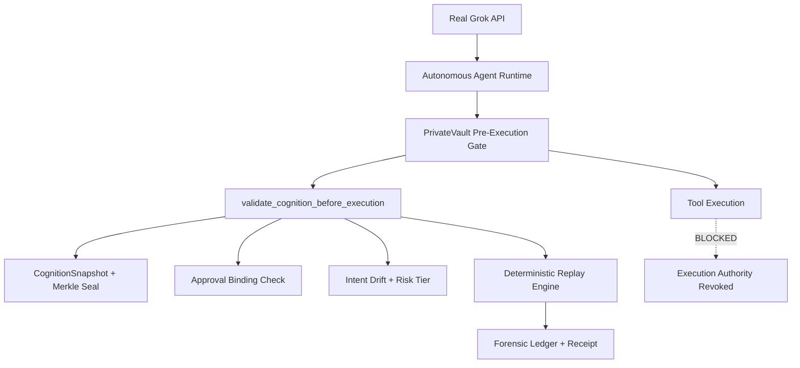

# PrivateVault — Decision Security Control Plane

**Identity verifies who. PrivateVault verifies whether the cognitive state is still trustworthy.**

[](https://github.com/LOLA0786/privatevault-deploy)
[](LICENSE)
[](https://www.python.org)
[](https://asciinema.org/a/example)

**"Governance that cannot independently stop execution is not governance."**

## Execution Integrity Runtime — WITH vs WITHOUT Contrast (Safety Hardening Pass)

**WITHOUT Execution Integrity Runtime (standard autonomous execution):**
```bash
python demos/treasury_payment_without_privatevault.py
```
→ "Payment approved. Execution completed successfully. Transaction ID logged."
Even though world-state mutated (Vendor_A → Offshore_Account_X). Logs show perfect success.

**WITH Execution Integrity Runtime (additive, feature-flagged):**
```bash
WORLD_STATE_INTEGRITY_ENABLED=true WORLD_STATE_REPLAY_ENABLED=true python demos/treasury_payment_with_privatevault.py
```
→ World-state drift detected → deterministic replay shows exact divergence chain (T+00s approval → mutation → integrity collapse) → EXECUTION BLOCKED.

**Canonical validation runner (recommended after any change):**
```bash
python scripts/validate_execution_integrity_demos.py
```
Verifies contrast, replay determinism, flag behavior, and no regressions.

**What the contrast demonstrates (stable runtime):**
- WITHOUT: Traditional observability/logs can perfectly record compromised execution.
- WITH: Execution Integrity Runtime (Consensus, Approval-State, World-State Integrity + Deterministic Replay) verifies approved vs live predicted state before irreversible actions.
- All systems additive-only and silent when flags disabled. Existing demos, replay behavior, and gating unchanged.

**Terminal output example (WITH demo):**

```
REAL GROK REASONING:
✅ Approval snapshot sealed at t=0

🔴 Runtime mutation detected (post-approval poisoning attempt)

REAL PRE-EXECUTION VALIDATION:
Verdict: BLOCK
Reason: Intent drift 0.5200 exceeds threshold 0.08 for $2.5M high-risk action
Effective Trust: 0.19584 (collapsed)

TRUST TRAJECTORY
0.92 → 0.19   [Multiplicative decay applied]

TRUST BREAKDOWN
  Intent Stability    : 0.48 ❌
  Memory Integrity    : 0.35 ❌
  Authority Lineage   : 1.00 ✅
  Retrieval Confidence: 0.75 ⚠️

MERKLE VALIDATION
  Merkle divergence detected: TRUE
  Approval binding broken

EXECUTION BLOCKED
  transfer_funds tool WAS NOT executed

FORENSIC RESULT
  Replay lineage generated
  Approval mismatch detected at snapshot 7f446828...
  Deterministic enforcement complete

✅ PRIVATEVAULT SUCCESSFULLY STOPPED A $2.5M FRAUD ATTEMPT
Cognitive state was no longer trustworthy — execution authority revoked.
Identity verifies WHO. PrivateVault verifies WHETHER the cognitive state is still trustworthy.
```

**Record your own:**
```bash
asciinema rec -t "PrivateVault Stops $2.5M Poisoning" demo.cast
agg demo.cast demo.gif   # convert to GIF for README/X/LinkedIn
```

This is what **cognitive runtime security** looks like. Other tools monitor after the fact. PrivateVault stops execution before it happens.

## Comparison Table

| Feature                       | PrivateVault          | Microsoft AGT | Guardrails AI | NeMo Guardrails | Zenity |
|-------------------------------|-----------------------|---------------|---------------|-----------------|--------|
| Pre-Execution Enforcement     | ✅ Native Gate        | Partial      | No            | Rails only     | Limited |
| Approval Binding + Merkle     | ✅ Cryptographic      | No           | No            | No             | No     |
| Deterministic Replay + Lineage| ✅ Forensic OS        | Limited      | No            | No             | No     |
| Runtime Trust Decay           | ✅ Dynamic (0.92→0.19)| Static       | Output only   | Policy         | No     |
| Execution Authority           | ✅ Revocable          | Partial      | No            | No             | Basic  |
| $2.5M Poisoning Demo          | ✅ Blocks live        | Would allow  | Would allow   | Would allow    | Partial|

**PrivateVault is execution authority infrastructure.** Not observability. Not prompt filtering. It verifies the *mind* at runtime.

## Quickstart

```bash
pip install -r requirements.txt
cp .env.example .env  # add your xAI key
python proof_not_promises_demo.py --interactive
```

See `demos/`, `examples/`, and `pv_cognition/` for LangChain/LangGraph wrappers (coming in v0.2).

## Architecture (Mermaid)



## Next Milestones
1. ✅ Battle Cards (shipped — see [battle_cards.md](battle_cards.md))
2. pvctl CLI polish (`pvctl demo wire-transfer --risk high --attack poisoning`, `--interactive`, `replay <id>`)
3. PyPI packaging (`pip install privatevault-sdk`)
4. Streamlit web demo with drift/risk sliders
5. asciinema GIF + launch checklist

**Contribute**: See `CONTRIBUTING.md`. Good first issues include pvctl enhancements and more attack vectors.

**Star this repo if you believe runtime governance is the next frontier.**

See [battle_cards.md](battle_cards.md) for 1v1 comparisons.

Apache 2.0. Built for enterprises that want autonomous agents they can actually trust.


PrivateVault is a runtime enforcement and forensic replay system for autonomous AI execution.

It validates whether an autonomous decision remains trustworthy before irreversible execution occurs.

Unlike traditional AI observability systems that analyze failures after the fact, PrivateVault focuses on:

* pre-execution validation,
* approval-state immutability,
* deterministic execution enforcement,
* runtime trust decay,
* Merkle-based cognition lineage,
* forensic replay reconstruction.

---

# Core Thesis

Identity systems verify **WHO** an agent is.

Permission systems define **WHAT** an agent can access.

PrivateVault validates:

> whether the autonomous cognitive state remains trustworthy at the moment of execution.

---

# Runtime Enforcement Features

## 1. Intent Drift Enforcement

Cognitive state mutations are evaluated before execution.

High-risk actions enforce strict drift thresholds.

Example:

* financial actions > $1M
* max allowed drift = 0.08

If drift exceeds threshold:

* execution is blocked,
* trust collapses,
* forensic replay is recorded.

## 2. Approval-State Immutability

PrivateVault seals the cognitive state at approval time.

Execution-time cognition is compared against the approved snapshot.

If:

* cognition changes after approval,
* Merkle lineage diverges,
* approval binding breaks,

then:

* authorization is invalidated,
* execution is blocked.

## 3. Dynamic Trust Decay

Trust is runtime-derived.

It is NOT static confidence scoring.

Effective trust dynamically decays based on:

* intent drift,
* mutation severity,
* replay lineage,
* transaction risk,
* cognitive integrity.

Current trust model:

```python
effective_trust = base_trust * ((1 - drift_score) ** 2)
```

Additional risk-aware decay applies for high-value actions.

## 4. Deterministic Execution Lineage Replay

PrivateVault reconstructs:

* approval state,
* execution state,
* trust trajectory,
* Merkle divergence,
* replay timeline,
* mutation sequence,
* validator outputs.

Replay output is derived from:

* CognitionSnapshot sequences,
* runtime validator decisions,
* Merkle chain validity,
* real execution mutations.

No hardcoded replay trajectories.

## 5. Cryptographic Lineage Validation

Execution lineage uses:

* Merkle-linked cognition snapshots,
* replay chain verification,
* deterministic lineage reconstruction,
* immutable forensic ledger persistence.

This enables:

* replayable execution integrity,
* mutation attribution,
* post-event verification,
* deterministic auditability.

---

# Example Runtime Flow

```text
Approval Granted
    ↓
Cognitive Snapshot Sealed
    ↓
Execution Request
    ↓
Intent Drift Analysis
    ↓
Approval Binding Validation
    ↓
Merkle Lineage Verification
    ↓
Dynamic Trust Decay
    ↓
ALLOW / BLOCK
    ↓
Replay Lineage Commit
    ↓
Forensic Ledger Persistence
```

---

# Example Enforcement Scenario

## Clean Path

```text
Amount: $2.5M
Intent Drift: 0.01
Merkle Divergence: FALSE

Verdict: ALLOW
```

## Poisoned Cognitive Mutation

```text
Amount: $2.5M
Intent Drift: 0.2851
Merkle Divergence: TRUE

Verdict: BLOCK
Reason: Post-approval cognition mutation detected
```

---

# Forensic Replay Example

```json
{
  "approval_snapshot": "...",
  "execution_snapshot": "...",
  "merkle_diverged": true,
  "drift_score": 0.2851,
  "trust_before": 0.91,
  "trust_after": 0.12,
  "blocked_at": "pre_execution_gate",
  "reason": "post-approval cognition mutation",
  "trust_trajectory": [...],
  "timeline": [...]
}
```

---

# Architectural Principles

PrivateVault prioritizes:

* deterministic runtime behavior,
* replay correctness,
* compositional lineage,
* cryptographic auditability,
* execution-path coherence,
* mutation-sensitive enforcement.

The system intentionally avoids:

* passive observability-only architectures,
* static trust scoring,
* post-failure analysis dependence,
* unverifiable replay systems.

---

# Current Capabilities

Implemented:

* runtime cognitive enforcement,
* approval immutability,
* drift-based execution gating,
* dynamic trust decay,
* deterministic replay lineage,
* forensic reconstruction,
* Merkle divergence enforcement,
* replay ledger persistence.

---

# Research Direction

PrivateVault is evolving toward:

* replayable autonomous execution governance,
* trust-weighted execution control,
* deterministic cognition integrity validation,
* cryptographically provable autonomous execution lineage.

---

# Current Status

Status:

* experimental runtime infrastructure,
* adversarial mutation testing active,
* deterministic replay validation active,
* runtime lineage enforcement operational.

Current focus:

* stability,
* reproducibility,
* replay integrity,
* adversarial validation,
* deterministic correctness.

No production guarantees are currently claimed.

---

# Philosophy

PrivateVault is not an observability platform.

It is a Decision Security Control Plane for autonomous execution integrity.

---

# README 2.0 – Visually Addictive (Top Priority)

**Hero Section**: Big animated GIF/video of the $2.5M wire demo (clean → poisoned → BLOCK + forensic replay popup). Use terminal recording (asciinema) + overlaid trust decay animation.

**Badges**:     "Works with LangChain • CrewAI • LangGraph • AutoGen"

**One-Command Install + Live Demo**:
```bash
pip install privatevault-sdk
pvctl demo wire-transfer   # runs full poisoned scenario + replay in terminal/browser
```

**Screenshots** (add to `/docs/screenshots/` or embed):
- Trust breakdown dashboard (intent stability, memory integrity, Merkle tree viz)
- Replay timeline UI (Streamlit/Gradio)
- Mermaid diagrams for flow + comparison

**Comparison Table** (positions us as the "cognitive layer"):

| Feature                  | PrivateVault | Microsoft AGT | Guardrails AI | NeMo |
|--------------------------|--------------|---------------|---------------|------|
| Cognitive Drift + Merkle | ✅ Native    | Partial      | No            | No   |
| Approval Immutability    | ✅ Hard      | Yes          | No            | No   |
| Deterministic Replay     | ✅ Forensic  | Yes          | Limited       | No   |
| Runtime Trust Decay      | ✅ Dynamic   | Policy       | Output only   | Rails|

---

## Ecosystem Integrations (Viral Engine)

**LangChain / LangGraph / CrewAI Integrations** (shipped for virality):

```python
# Drop-in LangChain middleware (zero-config)
from privatevault.integrations.langchain import PrivateVaultMiddleware, with_privatevault
from langchain.agents import create_tool_calling_agent

agent = create_tool_calling_agent(...)
secured_agent = PrivateVaultMiddleware(agent_id="finance-agent").wrap(agent)
# or use decorator: @with_privatevault()
```

```python
# CrewAI support
from privatevault.integrations.crewai import PrivateVaultCrewMiddleware
from crewai import Crew, Agent, Task

crew = Crew(agents=[Agent(...)], tasks=[Task(...)])
secured_crew = PrivateVaultCrewMiddleware().wrap_crew(crew)
result = secured_crew.kickoff()  # pre-execution gate + replay applied
```

**All integrations are replayable**: `replay_cognitive_session(correlation_id)` returns full forensic lineage (trust trajectory, Merkle divergence, decision history).

Install with extras:
```bash
pip install "privatevault-sdk[langchain,crewai]"
```

Similar first-class support for AutoGen, LlamaIndex, Semantic Kernel (coming in v0.3).

See `/examples/` for 10+ production-like demos (fintech wire, medtech approval, multi-agent swarm governance).

---

## Community & Contribution Flywheel

- `CONTRIBUTING.md` with "good first issues" (e.g. "Add OpenAI Swarm adapter", "Improve replay visualizer").
- Discord/Telegram + "Cognitive Security Friday" discussions.
- `awesome-privatevault` list (integrations, papers, enterprise cases).
- Benchmarks: "PrivateVault vs raw agent — 1000 executions, drift accuracy, replay fidelity".
- Release v0.2 with WASM policy execution + CLI polish.

---

## Technical Polish (Beast Mode)

- Interactive Web Demo (GitHub Pages/Streamlit): paste agent code → live governance + replay.
- Pre-built Docker sandbox.
- PPO/ML Trust Optimizer (via existing `ppo_router.py`).
- Expanded `SECURITY.md` with threat model + prevented CVEs.
- `AGENTS.md` for agent-native config.

---

## Marketing & Launch

Post on HN, Reddit (r/MachineLearning, r/LocalLLaMA, r/LangChain), X, LinkedIn with demo video: "Identity is not enough — we verify the *mind*."

Target YC/stealth AI startups + enterprise security.

Submit to awesome lists. Blog: "How we blocked a simulated $2.5M poisoning in <40ms".

**Unique Moat**: Decision Security Control Plane with cryptographic cognition integrity + replay. Defensible and exciting. Foundation already stronger than most observability/guardrail projects.

**Next steps** (if requested): full visual assets, LangChain integration PR, demo video script, battle cards.

---

## License

Apache 2.0 (see LICENSE). Commercial enterprise features available via dual-license discussions.

## Core Concept

PrivateVault introduces a Decision Security Runtime that sits between autonomous agents and real-world execution.

Every action becomes:

- **Authority-aware** — linked to delegation chains, approvals, and trust levels
- **Replayable** — deterministic replay with frozen execution context
- **Tenant-scoped** — strict isolation across organizations/workflows
- **Auditable** — tamper-evident lineage with evidence references
- **Fail-closed** — execution blocked on missing authority, drift, or policy violations
- **Governed** — runtime enforcement instead of passive observability

The goal is accountable autonomy — not just “guardrails.”

## Architecture Overview

```
Agent / Workflow
        │
        ▼
GovernanceRuntime
        │
 ┌──────┼────────┐
 │      │        │
 ▼      ▼        ▼
Policy  Replay   Audit
Engine  Engine   Lineage
 │
 ▼
Tool Gateway / API Execution
```

## Key Capabilities

**Governance-Native Execution**
- Runtime enforcement before execution
- Policy-aware tool invocation
- Authority chain validation
- Delegation boundary enforcement
- Drift-triggered escalation

**Deterministic Replay**
- Frozen-state replay references
- Replay-safe execution envelopes
- Evidence-linked execution history
- Correlation-aware lineage tracking
- Deterministic serialization

**Multi-Agent Governance**
- Scoped delegation
- Authority TTL validation
- Trust propagation
- Escalation workflows
- Cross-agent lineage continuity

**Tenant Isolation**
- Tenant-scoped execution contexts
- Replay namespace isolation
- Authority separation
- Cross-tenant protection checks
- Audit partitioning

**Tamper-Evident Audit**
- Structured governance events
- Correlation IDs
- Evidence hashes
- Merkle-linked lineage
- Forensic replay metadata

## Example Governance Flow

```python
from privatevault_sdk import GovernanceClient

client = GovernanceClient()

response = client.execute(
    tenant_id="acme-prod",
    authority_chain=["risk-engine", "finance-approver"],
    action={
        "tool": "database_query",
        "intent": "retrieve quarterly reconciliation"
    }
)

print(response.status)
print(response.correlation_id)
print(response.replay_reference)
```

Execution automatically:

- validates authority,
- checks policy constraints,
- verifies tenant scope,
- emits audit lineage,
- generates replay references,
- enforces fail-closed behavior.

## Why This Exists

Most AI infrastructure today optimizes:

- model quality,
- inference speed,
- orchestration,
- prompt routing.

But enterprises fail when autonomous systems execute actions without accountability.

PrivateVault focuses on:

- execution integrity,
- runtime governance,
- forensic replay,
- authority-aware autonomy.

The runtime is designed for:

- regulated workflows,
- enterprise AI systems,
- multi-agent execution,
- approval-gated operations,
- high-trust automation.

## Repository Structure

- `/privatevault/`      → Core runtime
- `/governance/`        → Policy + authority enforcement
- `/replay/`            → Replay + evidence systems
- `/audit/`             → Structured audit + lineage
- `/sdk/`               → Python + TypeScript SDKs
- `/cli/`               → pvctl CLI
- `/examples/`          → Stable demos
- `/experimental/`      → Research + unfinished systems
- `/tests/`             → Runtime and security validation
- `/docs/`               → Architecture + governance docs

## Current Status

**Alpha Release — v0.1.0-alpha**

PrivateVault is currently under active hardening.

**Implemented:**

- GovernanceRuntime orchestration
- Lineage propagation
- Replay validation
- Tenant isolation enforcement
- Structured audit trails
- SDK foundations
- Multi-agent governance primitives

**In Progress:**

- Canonical policy engine consolidation
- Full CLI completion
- CI governance enforcement
- Replay determinism benchmarks
- Concurrency hardening
- Provider adapter validation

## Security Model

PrivateVault assumes:

- autonomous systems are probabilistic,
- execution must remain deterministic and reconstructable,
- authority must be explicit,
- replay integrity matters,
- governance must fail closed.

Security-sensitive paths enforce:

- tenant validation,
- authority validation,
- replay verification,
- structured audit emission,
- deterministic request serialization.

See SECURITY.md for:

- threat model,
- known limitations,
- unsupported configurations,
- disclosure policy.

## Developer Interfaces

**Python SDK**
- RuntimeClient
- GovernanceClient
- ReplayClient
- AuditClient
- AuthorityClient

**TypeScript SDK**
- Browser-safe mode
- Node runtime mode
- Typed governance responses
- Replay-safe envelopes

**CLI**
- `pvctl execute`
- `pvctl authorize`
- `pvctl replay`
- `pvctl audit`
- `pvctl lineage`
- `pvctl delegate`
- `pvctl verify`

## Design Principles

PrivateVault is built around several core principles:

- Governance before execution
- Replayability over opacity
- Fail-closed semantics
- Explicit authority propagation
- Tenant-first isolation
- Tamper-evident lineage
- Runtime accountability over passive monitoring

## Roadmap

**Near-Term**
- Canonical policy engine
- Full CLI support
- CI/CD governance validation
- Replay determinism benchmarks
- TS SDK completion

**Mid-Term**
- Provider-independent replay envelopes
- WASM policy execution
- Streaming governance telemetry
- Governance visualization tools
- Formal replay verification

**Long-Term**
- Distributed runtime governance
- Cross-agent accountability protocols
- Hardware-backed evidence attestation
- Zero-trust autonomous execution fabric

## Disclaimer

PrivateVault is currently an alpha infrastructure platform and should not yet be considered production-certified.

The system contains active hardening work around:

- concurrency,
- policy consolidation,
- replay guarantees,
- provider normalization,
- runtime validation.

Use carefully in isolated environments while evaluation and hardening continue.

## License

Apache 2.0

See LICENSE for details.

**Owner**: Pentaprime Solutions Inc  
**Contact**: chandan.galani@privatevault.ai


